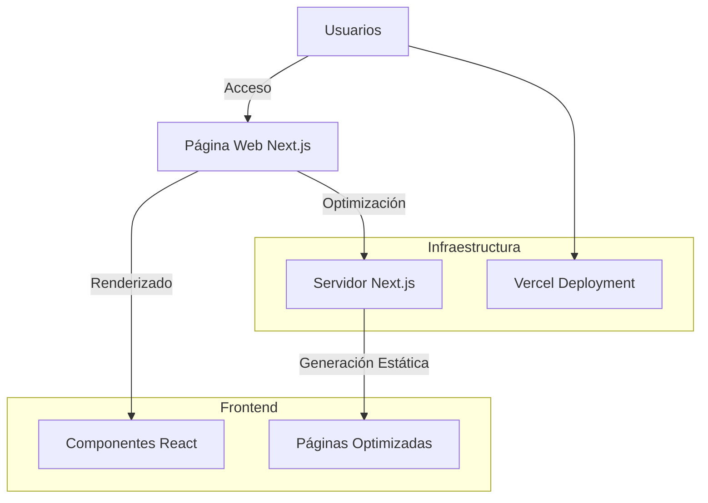

# MedellínJS Landing Page

## Objetivo del Proyecto

Este proyecto es la landing page oficial de la comunidad MedellínJS, diseñada para ser un punto de encuentro digital para desarrolladores JavaScript en Medellín. Nuestro objetivo es crear una plataforma moderna, accesible y atractiva que represente la vibrante comunidad tecnológica de la ciudad.

## Arquitectura del Proyecto

### Diagrama de Arquitectura



## Stack Tecnológico

### Frontend
- **Framework:** Next.js 14
- **Lenguaje:** TypeScript
- **Estilos:** Tailwind CSS
- **Fuente:** Geist (Vercel Font)

### Infraestructura
- **Plataforma de Despliegue:** Vercel
- **Repositorio:** GitHub
- **Integración Continua:** GitHub Actions

## Estructura del Proyecto

```
medellinjs-landing/
│
├── app/                # Rutas y componentes principales
│   ├── page.tsx        # Página principal
│   ├── layout.tsx      # Diseño base de la aplicación
│   └── ...
│
├── components/         # Componentes reutilizables
│   ├── Header.tsx
│   ├── Footer.tsx
│   └── ...
│
├── public/             # Recursos estáticos
│   ├── images/
│   └── icons/
│
├── styles/             # Estilos globales
│   └── globals.css
│
├── lib/                # Utilidades y helpers
│   └── utils.ts
│
└── README.md           # Documentación del proyecto
```

## Relaciones de Componentes

- **Layout Principal:** Gestiona la estructura base de la aplicación
- **Componentes:** Modularizados y reutilizables
- **Páginas:** Generadas estáticamente para máximo rendimiento

## Comenzando

### Requisitos Previos
- Node.js 18+
- npm/yarn/pnpm

### Instalación

1. Clonar el repositorio
```bash
git clone https://github.com/medellinjs/landing.git
cd landing
```

2. Instalar dependencias
```bash
npm install
```

3. Ejecutar en desarrollo
```bash
npm run dev
```

## Contribuciones

¡Las contribuciones son bienvenidas! Por favor, lee nuestras [guías de contribución](CONTRIBUTING.md).

## Licencia

[Especificar Licencia]

## Contacto

- **Comunidad:** MedellínJS
- **Email:** [contacto@medellinjs.org]
- **Web:** [https://medellinjs.org]
