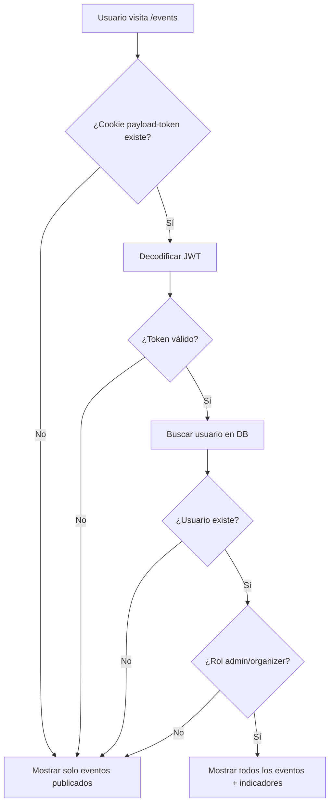

# Control de Acceso para Eventos No Publicados

## Resumen

Se ha implementado un sistema de control de acceso que permite que los eventos no publicados (`isPublished: false`) solo sean visibles para usuarios autenticados en el panel de administración de Payload CMS con roles de `admin` u `organizer`.

## Cambios Implementados

### 1. **Autenticación de Usuarios de Payload CMS** (`src/lib/payload/queries.ts`)

Se agregaron nuevas funciones para detectar si hay un usuario de Payload CMS autenticado:

- `getPayloadUser()`: Obtiene el usuario autenticado del admin panel desde las cookies de sesión
- `isAdminOrOrganizer()`: Verifica si el usuario tiene rol de `admin` u `organizer`

#### Implementación de Seguridad

La función `getPayloadUser()` decodifica el JWT token de la cookie `payload-token` y luego valida que el usuario existe en la base de datos. Esto proporciona dos capas de validación:

1. Decodificación del JWT para obtener el ID del usuario
2. Verificación en la base de datos de que el usuario existe y está activo

### 2. **Actualización de Queries** (`src/lib/payload/queries.ts`)

#### `getPublishedEvents()`

```typescript
export async function getPublishedEvents(options: GetEventsOptions = {}): Promise<{ docs: Event[]; totalDocs: number; totalPages: number }> {
  const { limit = 50, page = 1, includeUnpublished = false } = options
  const payload = await getPayload()
  const user = await getPayloadUser()
  const canSeeUnpublished = includeUnpublished && isAdminOrOrganizer(user)

  // Solo muestra eventos no publicados si el usuario es admin/organizer
  // Y se pasó includeUnpublished: true
}
```

#### `getEventBySlug()`

```typescript
export async function getEventBySlug(slug: string): Promise<Event | null> {
  // Verifica si el usuario es admin/organizer
  // Si no lo es, solo devuelve eventos publicados
  // Si lo es, devuelve cualquier evento que coincida con el slug
}
```

### 3. **Actualización de Páginas Frontend**

#### Lista de Eventos (`src/app/(frontend)/events/page.tsx`)

```typescript
// Ahora pasa includeUnpublished: true para permitir a admins/organizers ver borradores
const { docs: events } = await getPublishedEvents({ includeUnpublished: true })
```

#### Detalle de Evento (`src/app/(frontend)/events/[slug]/page.tsx`)

```typescript
// getEventBySlug ahora maneja el control de acceso automáticamente
// Devuelve null si el evento no está publicado y el usuario no es admin/organizer
if (!event) {
  notFound()
}
```

### 4. **Indicadores Visuales**

#### EventCard (`src/components/events/EventCard.tsx`)

Se agregó un badge "Borrador" (naranja) en la esquina superior izquierda para eventos no publicados:

```tsx
{!event.isPublished && (
  <div className="absolute top-4 left-4 bg-orange-500 text-white px-3 py-1 rounded-full text-sm font-medium">
    Borrador
  </div>
)}
```

#### EventDetail (`src/components/events/EventDetail.tsx`)

Se agregó un banner fijo en la parte superior de la página para eventos no publicados:

```tsx
{!event.isPublished && (
  <div className="fixed top-0 left-0 right-0 z-50 bg-orange-500 text-white px-4 py-2 text-center text-sm font-medium">
    ⚠️ Este evento está en modo borrador y solo es visible para administradores y organizadores
  </div>
)}
```

## Comportamiento del Sistema

### Para Usuarios Públicos (No Autenticados)

- ✅ Pueden ver eventos con `isPublished: true`
- ❌ No pueden ver eventos con `isPublished: false`
- ❌ Reciben 404 si intentan acceder directamente a un evento no publicado

### Para Usuarios Autenticados (Admin/Organizer en Payload CMS)

- ✅ Pueden ver todos los eventos publicados
- ✅ Pueden ver todos los eventos no publicados (borradores)
- ✅ Ven indicadores visuales claros en eventos no publicados
- ✅ Pueden navegar y revisar eventos antes de publicarlos

### Para Usuarios de LinkedIn (NextAuth)

Los usuarios que se autentican con LinkedIn (frontend público) **NO** tienen acceso a eventos no publicados. Solo los usuarios del admin panel de Payload CMS pueden ver borradores.

## Flujo de Autenticación



## Pruebas

### 1. Verificar que público no ve eventos no publicados

1. Abre una ventana de incógnito
2. Navega a `/events`
3. Verifica que solo se muestran eventos con `isPublished: true`

### 2. Verificar que admin/organizer sí ve eventos no publicados

1. Inicia sesión en el admin de Payload CMS (`/admin`)
2. En la misma ventana/navegador, navega a `/events` (frontend)
3. Deberías ver eventos no publicados con el badge "Borrador"
4. Al hacer clic en un evento no publicado, deberías ver el banner naranja en la parte superior

### 3. Verificar acceso directo a evento no publicado

**Como usuario público:**
1. Intenta acceder a `/events/[slug-evento-no-publicado]`
2. Deberías recibir un 404

**Como admin/organizer:**
1. Accede a `/events/[slug-evento-no-publicado]`
2. Deberías ver el evento con el banner de advertencia

## Seguridad

### ✅ Lo que está protegido

- Eventos no publicados no aparecen en la lista para usuarios públicos
- Eventos no publicados no son accesibles directamente por URL para usuarios públicos
- Solo usuarios con rol `admin` u `organizer` en Payload CMS pueden ver borradores

### ⚠️ Consideraciones

- El JWT se decodifica sin verificar la firma (solo se verifica la existencia del usuario en DB)
- Esto es una optimización para evitar dependencias adicionales
- La verificación en DB proporciona suficiente seguridad ya que:
  - El token solo se puede obtener iniciando sesión en Payload
  - El usuario debe existir y estar activo en la DB
  - La cookie `payload-token` es HTTP-only y segura

### 🔒 Mejoras de Seguridad Futuras (Opcional)

Si se necesita mayor seguridad, se puede instalar `jsonwebtoken` y verificar la firma del JWT:

```bash
pnpm add jsonwebtoken @types/jsonwebtoken
```

```typescript
import jwt from 'jsonwebtoken'

const decoded = jwt.verify(token.value, process.env.PAYLOAD_SECRET) as { id: string; collection: string }
```

## Archivos Modificados

- ✅ `src/lib/payload/queries.ts` - Lógica de autenticación y queries
- ✅ `src/app/(frontend)/events/page.tsx` - Lista de eventos
- ✅ `src/app/(frontend)/events/[slug]/page.tsx` - Detalle de evento
- ✅ `src/components/events/EventCard.tsx` - Indicador visual en tarjetas
- ✅ `src/components/events/EventDetail.tsx` - Banner de advertencia

## Archivos No Modificados

- ✅ `src/collections/Events.ts` - Los permisos de acceso ya estaban correctos
- ✅ `src/collections/Users.ts` - La estructura de roles ya existía

## Conclusión

La implementación permite que admins y organizadores puedan:

1. **Previsualizar eventos** antes de publicarlos
2. **Compartir borradores** con otros admins/organizadores
3. **Identificar claramente** qué eventos están publicados y cuáles no
4. **Mantener control total** sobre qué eventos son visibles al público

Todo esto mientras se mantiene la seguridad de que usuarios públicos no pueden acceder a eventos no publicados.

